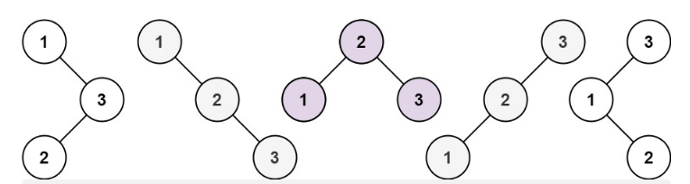

参考文章：代码随想录https://programmercarl.com/0096.%E4%B8%8D%E5%90%8C%E7%9A%84%E4%BA%8C%E5%8F%89%E6%90%9C%E7%B4%A2%E6%A0%91.html

# 一、题目

给你一个整数 n ，求恰由 n 个节点组成且节点值从 1 到 n 互不相同的 二叉搜索树 有多少种？返回满足题意的二叉搜索树的种数。

示例 1：



```
输入：n = 3
输出：5
```

示例 2：

```
输入：n = 1
输出：1
```


提示：

* 1 <= n <= 19

来源：力扣（LeetCode）链接：https://leetcode.cn/problems/unique-binary-search-trees

# 二、题解

我认为本题难点有二：

* 意识到这个问题可以用动态规划解决
* 推导出递推公式

面对这种一开始毫无思绪的问题，不妨先分析 n=1、n=2 和 n=3 的情况，寻找规律

n 为 1 的时候有一棵树，n 为 2 有两棵树，这个是很直观的


n=3 时有五种情况，如示例 1 所示


当 1 为头结点的时候，其右子树有两个节点，这两个节点的布局和 n 为 2 的时候两棵树的布局是一样的（由于我们是求不同树的数量，并不用把搜索树都列出来，所以不用关心其具体数值的差异）

当 2 为头结点的时候，其左右子树都只有一个节点，布局和 n 为 1 的时候只有一棵树的布局也是一样

当 3 为头结点的时候，其左子树有两个节点，这两个节点的布局，和 n 为 2 的时候两棵树的布局也是一样

发现到这里，其实我们就找到了重叠子问题了，其实也就是发现可以通过 dp[1] 和 dp[2] 来推导出来 dp[3] 的某种方式。

dp[3]，就是元素 1 为头结点搜索树的数量 + 元素 2 为头结点搜索树的数量 + 元素 3 为头结点搜索树的数量

元素 1 为头结点搜索树的数量 = 右子树有 2 个元素的搜索树数量 * 左子树有 0 个元素的搜索树数量

元素 2 为头结点搜索树的数量 = 右子树有 1 个元素的搜索树数量 * 左子树有 1 个元素的搜索树数量

元素 3 为头结点搜索树的数量 = 右子树有 0 个元素的搜索树数量 * 左子树有 2 个元素的搜索树数量

有 2 个元素的搜索树数量就是 dp[2]。

有 1 个元素的搜索树数量就是 dp[1]。

有 0 个元素的搜索树数量就是 dp[0]。

所以 dp[3] = dp[2] * dp[0] + dp[1] * dp[1] + dp[0] * dp[2]


发现规律后，

此时我们已经找到递推关系了，那么可以用动规五部曲再系统分析一遍。

1. 确定 dp 数组以及下标的含义

**dp[i] ：1 到 i 为节点组成的二叉搜索树的个数**。

也可以理解是 i 个不同元素节点组成的二叉搜索树的个数为 dp[i] ，都是一样的。

2. 确定递推公式

在上面的分析中，其实已经看出其递推关系， dp[i] += dp[以 j 为头结点左子树节点数量] * dp[以 j 为头结点右子树节点数量]

j 相当于是头结点的元素，从 1 遍历到 i 为止。

所以递推公式：**dp[i] += dp[j - 1] * dp[i - j]**，j-1 为 以 j 为头结点左子树节点数量，i-j 为以 j 为头结点右子树节点数量

3. dp 数组如何初始化

初始化，只需要初始化 dp[0] 就可以了，推导的基础，都是 dp[0]。

那么 dp[0] 应该是多少呢？

从定义上来讲，空节点也是一棵二叉树，也是一棵二叉搜索树，这是可以说得通的。

从递归公式上来讲，dp[以 j 为头结点左子树节点数量] * dp[以 j 为头结点右子树节点数量] 中以 j 为头结点左子树节点数量为 0，也需要 dp[以 j 为头结点左子树节点数量] = 1， 否则乘法的结果就都变成 0 了。

所以初始化 dp[0] = 1

4. 确定遍历顺序

首先一定是遍历节点数，从递归公式：dp[i] += dp[j - 1] * dp[i - j] 可以看出，节点数为 i 的状态是依靠 i 之前节点数的状态。

那么遍历 i 里面每一个数作为头结点的状态，用 j 来遍历。

代码如下：

```cpp
for (int i = 1; i <= n; i++) {
    for (int j = 1; j <= i; j++) {
        dp[i] += dp[j - 1] * dp[i - j];
    }
}
```

5. 举例推导dp数组

n 为 5 时候的 dp 数组状态为：[1,1,2,5,14,42]

# 三、代码

```java
public class T96 {
    public int numTrees(int n) {
        //初始化 dp 数组
        int[] dp = new int[n+1];
        //初始化0个节点、1个节点和2个结点的情况
        dp[0]=1;
        //此处也可以不初始化dp[1]和dp[2]，因为从dp[1]开始就可以通过递推公式计算得出
        dp[1]=1;
        //之所以加if条件，是因为测试用例有输入n=1的情况，此时会数组索引越界异常
        if(n>=2)
	        dp[2]=2;
        for (int i = 3; i <= n ; i++) {
            for (int j = 1; j <= i; j++) {
                //对于第i个节点，需要考虑1作为根节点直到i作为根节点的情况，所以需要累加
                //一共i个节点，对于根节点j时,左子树的节点个数为j-1，右子树的节点个数为i-j
                dp[i] += dp[j-1]*dp[i-j];
            }
        }
        return dp[n];
    }
}
```

