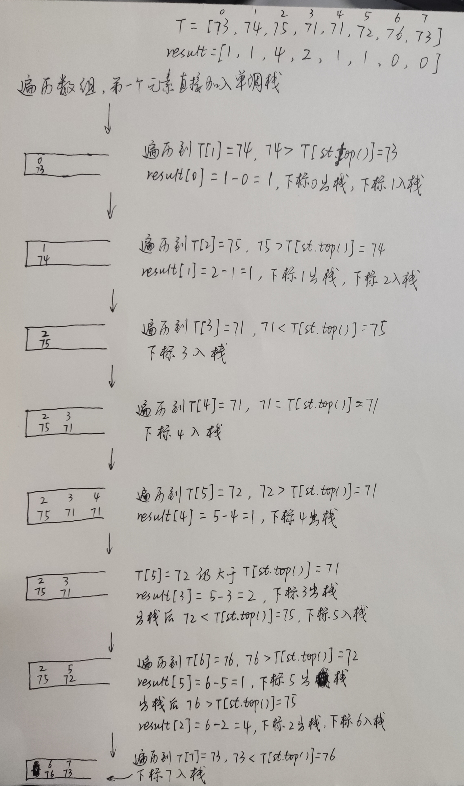

参考文章：代码随想录https://programmercarl.com/0739.%E6%AF%8F%E6%97%A5%E6%B8%A9%E5%BA%A6.html

# 一、题目

给定一个整数数组 temperatures ，表示每天的温度，返回一个数组 answer ，其中 answer[i] 是指对于第 i 天，下一个更高温度出现在几天后。如果气温在这之后都不会升高，请在该位置用 0 来代替。

示例 1:

```
输入: temperatures = [73,74,75,71,69,72,76,73]
输出: [1,1,4,2,1,1,0,0]
```

示例 2:

```
输入: temperatures = [30,40,50,60]
输出: [1,1,1,0]
```

示例 3:

```
输入: temperatures = [30,60,90]
输出: [1,1,0]
```


提示：

* 1 <= temperatures.length <= 105
* 30 <= temperatures[i] <= 100

来源：力扣（LeetCode）链接：https://leetcode.cn/problems/daily-temperatures

# 二、题解

首先想到的当然是暴力解法，两层 for 循环，把至少需要等待的天数就搜出来了。时间复杂度是 O(n^2)

再看看使用单调栈的解法。

怎么能想到用单调栈呢？ 什么时候用单调栈呢？

> **通常是一维数组，要寻找任一个元素的右边或者左边第一个比自己大或者小的元素的位置，此时我们就要想到可以用单调栈了**。时间复杂度为O(n)。

例如本题其实就是找到一个元素右边第一个比自己大的元素，此时就应该想到用单调栈了。

单调栈的原理是什么呢？为什么时间复杂度是 O(n) 就可以找到每一个元素的右边第一个比它大的元素位置呢？

> **单调栈的本质是空间换时间**，因为在遍历的过程中需要用一个栈来记录右边第一个比当前元素高的元素，优点是整个数组只需要遍历一次。

**更直白来说，就是用一个栈来记录我们遍历过的元素**，因为我们遍历数组的时候，我们不知道之前都遍历了哪些元素，以至于遍历一个元素找不到是不是之前遍历过一个更小的，所以我们需要用一个容器（这里用单调栈）来记录我们遍历过的元素。

在使用单调栈的时候首先要明确如下几点：

1. 单调栈里存放的元素是什么？

单调栈里只需要存放元素的下标 i 就可以了，这样才能通过下标相减求出两个温度间隔的天数。如果需要使用对应的元素，直接 T[i] 就可以获取。

2. 单调栈里元素是递增呢？ 还是递减呢？

**注意以下讲解中，顺序的描述为 从栈头到栈底的顺序**，因为单纯的说从左到右或者从前到后，不说栈头朝哪个方向的话，大家一定比较懵。

这里我们要使用递增循序（再强调一下是指从栈头到栈底的顺序），因为只有递增的时候，栈里要加入一个元素 i的时候，才知道栈顶元素在数组中右面第一个比栈顶元素大的元素是 i。

即：如果求一个元素右边第一个更大元素，单调栈就是递增的，如果求一个元素右边第一个更小元素，单调栈就是递减的。

使用单调栈主要有三个判断条件。

* 当前遍历的元素 T[i] 小于栈顶元素 T[st.top()] 的情况
* 当前遍历的元素 T[i] 等于栈顶元素 T[st.top()] 的情况
* 当前遍历的元素 T[i] 大于栈顶元素 T[st.top()] 的情况

把这三种情况分析清楚了，也就理解透彻了。


对应到本题，利用单调栈的解题思路就是：

可以维护一个存储下标的单调栈，从栈顶到栈底的下标对应的温度列表中的温度依次递增。如果一个下标在单调栈里，则表示尚未找到下一次温度更高的下标。

正向遍历温度列表。对于温度列表中的每个元素 temperatures[i]，如果栈为空，则直接将 i 进栈，如果栈不为空，则比较栈顶元素 prevIndex 对应的温度 temperatures[prevIndex] 和当前温度 temperatures[i]，如果 temperatures[i] > temperatures[prevIndex]，则将 prevIndex 移除，并将 prevIndex 对应的等待天数赋为 i - prevIndex，重复上述操作直到栈为空或者栈顶元素对应的温度小于等于当前温度，然后将 i 进栈。如果 temperatures[i] > or = temperatures[prevIndex]，则直接将 i 进栈。

为什么可以在弹栈的时候更新 ans[prevIndex] 呢？因为在这种情况下，即将进栈的 i 对应的 temperatures[i] 一定是 temperatures[prevIndex] 右边第一个比它大的元素，试想如果 prevIndex 和 i 有比它大的元素，假设下标为 j，那么 prevIndex 一定会在下标 j 的那一轮被弹掉。

由于单调栈满足从栈底到栈顶元素对应的温度递减，因此每次有元素进栈时，会将温度更低的元素全部移除，并更新出栈元素对应的等待天数，这样可以确保等待天数一定是最小的。

接下来我们用 temperatures = [73, 74, 75, 71, 71, 72, 76, 73] 为例来逐步分析，输出应该是 [1, 1, 4, 2, 1, 1, 0, 0]。



至于 下标 6 和下标 7 一直在栈里，result[6] 和 result[7] 也就没法更新，所以定义 result 数组的时候，就应该直接初始化为 0，如果 result 没有更新，说明这个元素右面没有更大的了，也就是为 0。

# 三、代码

```java
public class T739 {
    //非精简版本
    public int[] dailyTemperatures(int[] temperatures) {
        //递增栈
        Stack<Integer> stack = new Stack<>();
        int[] result = new int[temperatures.length];
        stack.push(0);
        for (int i = 1; i < temperatures.length; i++) {
            if (temperatures[i]<temperatures[stack.peek()]){//情况一
                stack.push(i);
            }else if (temperatures[i]<temperatures[stack.peek()]){//情况二
                stack.push(i);
            }else {//情况三
                while (!stack.isEmpty() && temperatures[i]>temperatures[stack.peek()]){
                    result[stack.peek()] = i- stack.peek();
                    stack.pop();
                }
                stack.push(i);
            }
        }
        return result;
    }

    //精简版本
    /*public int[] dailyTemperatures(int[] temperatures) {
        //递增栈
        Stack<Integer> stack = new Stack<>();
        int[] result = new int[temperatures.length];
        for (int i = 0; i < temperatures.length; i++) {
            // 注意栈不能为空
            while (!stack.isEmpty() && temperatures[i]>temperatures[stack.peek()]){
                result[stack.peek()] = i- stack.peek();
                stack.pop();
            }
            stack.push(i);
        }
        return result;
    }*/
}
```

