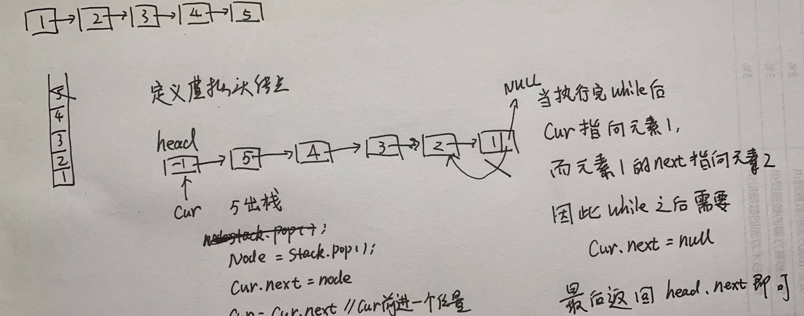

参考文章：代码随想录https://programmercarl.com/0206.%E7%BF%BB%E8%BD%AC%E9%93%BE%E8%A1%A8.html

# 一、题目

给你单链表的头节点 head ，请你反转链表，并返回反转后的链表。

示例 1：

```
输入：head = [1,2,3,4,5]
输出：[5,4,3,2,1]
```

示例 2：

```
输入：head = [1,2]
输出：[2,1]
```

示例 3：

```
输入：head = []
输出：[]
```


提示：

* 链表中节点的数目范围是 [0, 5000]
* -5000 <= Node.val <= 5000

来源：力扣（LeetCode）链接：https://leetcode.cn/problems/reverse-linked-list

# 方法一：双指针法

首先定义一个 cur 指针，指向头结点，再定义一个 pre 指针，初始化为 null。

然后就要开始反转了，一定注意首先要把 cur->next 节点用 tmp 指针保存一下，也就是保存一下这个节点。

为什么要保存一下这个节点呢，因为接下来要改变 cur->next 的指向了，将 cur->next 指向 pre ，此时已经反转了第一个节点了。

接下来，就是循环走如下代码逻辑了，继续移动 pre 和 cur 指针。

最后，cur 指针已经指向了 null，循环结束，链表也反转完毕了。 此时我们 return pre 指针就可以了，pre 指针就指向了新的头结点

反转过程如动画所示：（纠正：动画应该是先移动 pre，再移动 cur）


```java
public class T206 {
    //方法一：双指针法
    public ListNode reverseList(ListNode head) {
        ListNode cur = head;
        ListNode pre = null;
        ListNode tmp;//保存cur的下一个节点
        while (cur!=null){
            //保存一下cur的下一个节点，因为接下来要改变cur->next
            tmp = cur.next;
            cur.next = pre;//翻转操作
            //更新pre和cur指针
            pre = cur;
            cur = tmp;
        }
        return pre;
    }

    private class ListNode {
        int val;
        ListNode next;
        ListNode() {}
        ListNode(int val) { this.val = val; }
        ListNode(int val, ListNode next) { this.val = val; this.next = next; }
    }
}
```

# 方法二：从前向后递归

递归法相对抽象一些，但是其实和双指针法是一样的逻辑，同样是当 cur 为空的时候循环结束，不断将 cur 指向pre 的过程。

关键是初始化的地方，可能有的同学会不理解， 可以看到双指针法中初始化 cur = head，pre = null，在递归法中可以从如下代码看出初始化的逻辑也是一样的，只不过写法变了。

双指针法写出来之后，理解如下递归写法就不难了，代码逻辑都是一样的

```java
public class T206 {
    //方法二：递归法,从前向后递归
    public ListNode reverseList(ListNode head) {
        //和双指针法初始化是一样的逻辑
        //ListNode cur = head;
        //ListNode pre = NULL;
        return reverse(head,null);
    }
    private ListNode reverse(ListNode cur,ListNode pre){
        if (cur==null){
            return pre;
        }
        ListNode tmp = cur.next;
        cur.next = pre;
        //可以和双指针法的代码进行对比，如下递归的写法，其实就是做了这两步
        //pre = cur;
        //cur = temp;
        return reverse(tmp,cur);
    }

    private class ListNode {
        int val;
        ListNode next;
        ListNode() {}
        ListNode(int val) { this.val = val; }
        ListNode(int val, ListNode next) { this.val = val; this.next = next; }
    }
}
```

# 方法三：从后向前递归

上面的递归写法和双指针法实质上都是从前往后翻转指针指向，其实还有另外一种与双指针法不同思路的递归写法：从后往前翻转指针指向。

其实就是先翻转最后一个节点，由于是最后一个结点，会直接返回这个结点。然后翻转倒数第二个结点与最后一个节点，依此类推，直到完成第一个结点和第二个结点的翻转，便完成了整个链表的翻转。

而递归函数返回的始终是原链表的最后一个结点，这个结点就是最终要返回的反转后的新链表的头结点

```java
public class T206 {
    //方法三：递归法，从后向前递归
    public ListNode reverseList(ListNode head) {
        // 边缘条件判断
        if (head==null){
            return null;
        }
        if (head.next==null){
            return head;
        }
        //递归调用，翻转第二个节点开始往后的链表
        ListNode newHead = reverseList(head.next);
        // 翻转头节点与第二个节点的指向
        head.next.next = head;
        //此时的head节点为尾节点，next需要指向null
        head.next = null;
        return newHead;
    }   

    private class ListNode {
        int val;
        ListNode next;
        ListNode() {}
        ListNode(int val) { this.val = val; }
        ListNode(int val, ListNode next) { this.val = val; this.next = next; }
    }
}
```

# 方法四：虚拟头结点 + 头插法

使用虚拟头结点，通过头插法实现链表的翻转（不需要栈）

遍历每一个结点，依次头插到虚拟头结点所指向的链表中（虚拟头结点最开始指向一个空链表），最终便能达到翻转原链表的效果

也要注意每次循环时先用一个临时变量保存 cur 的下一个结点

```java
public class T206 {
    //方法四：迭代方法：增加虚头结点，使用头插法实现链表翻转（不需要栈）
    public ListNode reverseList(ListNode head) {
        // 创建虚拟头结点
        ListNode dummyHead = new ListNode();
        dummyHead.next = null;
        // 遍历所有节点
        ListNode cur = head;
        ListNode tmp;
        while (cur!=null){
            //头插法
            tmp = cur.next;
            cur.next = dummyHead.next;
            dummyHead.next = cur;
            cur = tmp;
        }
        return dummyHead.next;
    }

    private class ListNode {
        int val;
        ListNode next;
        ListNode() {}
        ListNode(int val) { this.val = val; }
        ListNode(int val, ListNode next) { this.val = val; this.next = next; }
    }
}
```

# 方法五：使用栈

由于栈具有先进后出的特性，入栈元素和出栈元素的顺序刚好相反，所以想到使用栈解决反转链表的问题

1. 首先将所有的结点入栈

2. 然后创建一个虚拟虚拟头结点，让 cur 指向虚拟头结点。然后开始循环出栈，每出来一个元素，就把它加入到以虚拟头结点为头结点的链表当中，最后返回即可。

采用这种方法需要注意一点：就是当整个出栈循环结束以后，cur 正好指向原来链表的第一个结点，而此时原来第一个结点的 next 指向的仍是结点 2，因此最后还需要 `cur.next = null`



```java
public class T206 {
    //方法五：使用栈解决反转链表的问题
    public ListNode reverseList(ListNode head) {
        // 如果链表为空，则返回空
        if (head==null){
            return null;
        }
        // 如果链表中只有只有一个元素，则直接返回
        if (head.next==null){
            return head;
        }
        // 创建栈,每一个结点都入栈
        Stack<ListNode> stack = new Stack<>();
        ListNode cur = head;
        while (cur!=null){
            stack.push(cur);
            cur = cur.next;
        }

        //创建一个虚拟头结点
        ListNode dummyHead = new ListNode();
        cur = dummyHead;
        while (!stack.isEmpty()){
            ListNode node = stack.pop();
            cur.next = node;
            cur = cur.next;
        }
        //最后一个元素的next要赋值为空
        cur.next = null;
        return dummyHead.next;
    }

    private class ListNode {
        int val;
        ListNode next;
        ListNode() {}
        ListNode(int val) { this.val = val; }
        ListNode(int val, ListNode next) { this.val = val; this.next = next; }
    }
}
```


